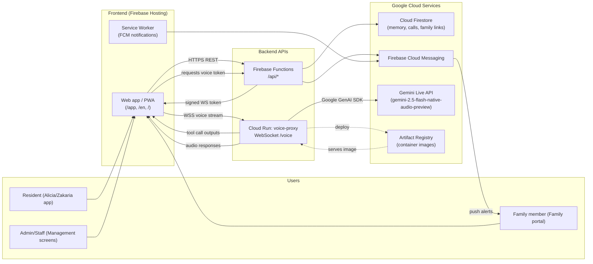

# Architecture Diagram

```mermaid
flowchart LR
  subgraph U["Users"]
    R["Resident (Alicia/Zakaria app)"]
    F["Family member (Family portal)"]
    A["Admin/Staff (Management screens)"]
  end

  subgraph FE["Frontend (Firebase Hosting)"]
    WEB["Web app / PWA\n(/app, /en, /)"]
    SW["Service Worker\n(FCM notifications)"]
  end

  subgraph BE["Backend APIs"]
    CF["Firebase Functions\n/api/*"]
    VP["Cloud Run: voice-proxy\nWebSocket /voice"]
  end

  subgraph GCP["Google Cloud Services"]
    FS["Cloud Firestore\n(memory, calls, family links)"]
    FCM["Firebase Cloud Messaging"]
    GEM["Gemini Live API\n(gemini-2.5-flash-native-audio-preview)"]
    AR["Artifact Registry\n(container images)"]
  end

  R --> WEB
  F --> WEB
  A --> WEB

  WEB -->|HTTPS REST| CF
  WEB -->|WSS voice stream| VP
  WEB -->|requests voice token| CF
  CF -->|signed WS token| WEB

  CF --> FS
  CF --> FCM
  SW --> FCM
  FCM -->|push alerts| F

  VP -->|Google GenAI SDK| GEM
  VP -->|tool call outputs| WEB
  VP -->|audio responses| WEB

  VP -. deploy .-> AR
  AR -. serves image .-> VP
```

